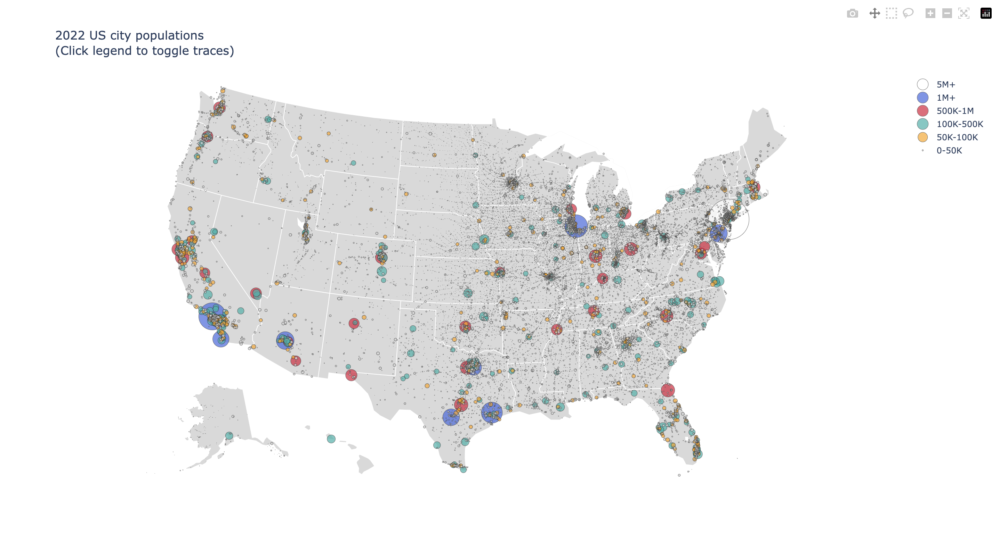

# US City Populations Visualization

Visualize US city populations on a map. Cities are represented by circles sized and colored by population.




## Setup
```bash
git clone https://github.com/matteo-psnt/US-city-visualization.git
cd US-city-visualization
pip install -r requirements.txt
```

## Usage
To view the visualization for a specific year, use the -year flag with main.py. The default year is 2022.'
```bash
python3 main.py -year [year] # default=2022
```

To scrape data and generate a new CSV file, run scraper.py. The default year for scraping is 2022. Use the -cached flag to utilize the cached CSV file for location lookups.
```bash
python3 scraper.py -cached -year [year] # default=2022
```

## Data Structure
 **Rows seperated by:**     

- US Population Rank,               
- City,                           
- State,              
- Population,
- Longitude,  
- Latitude  


## **Sources**       
Top 100 Biggest US Cities By Population       
https://www.biggestuscities.com/

GeoPy       
https://github.com/geopy/geopy

Run main.py to view a visualization of the data on a map of the US.
